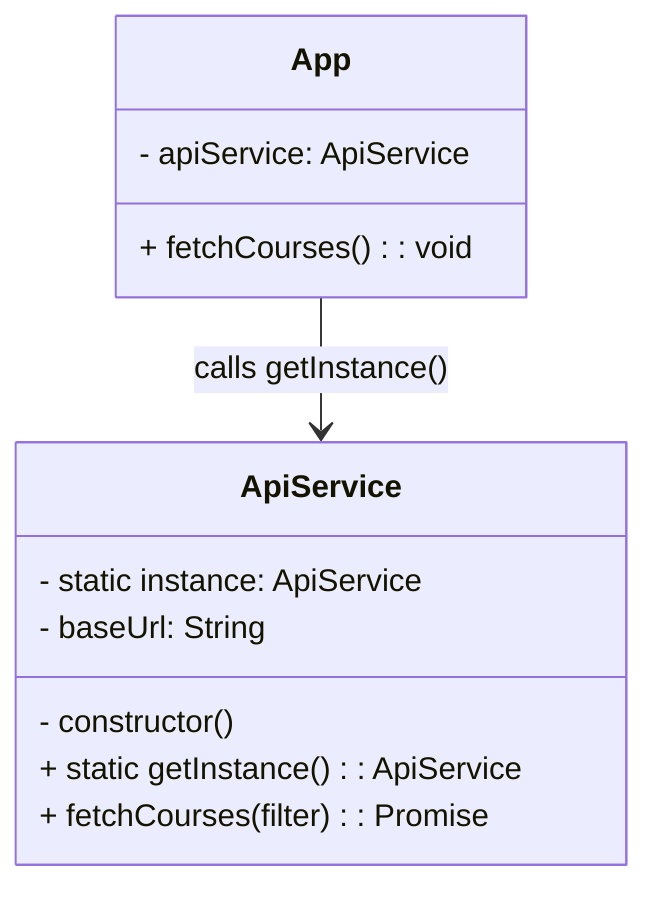
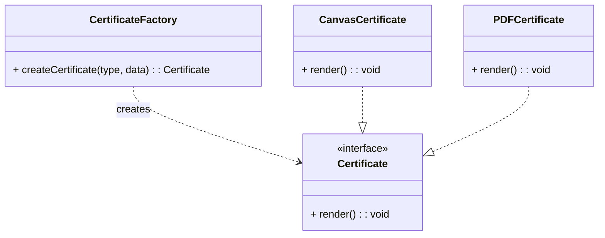
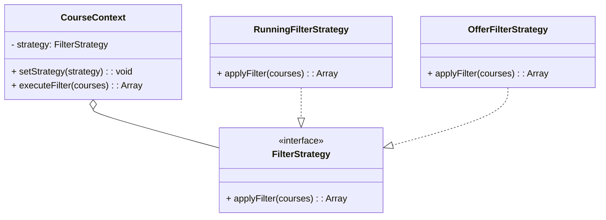
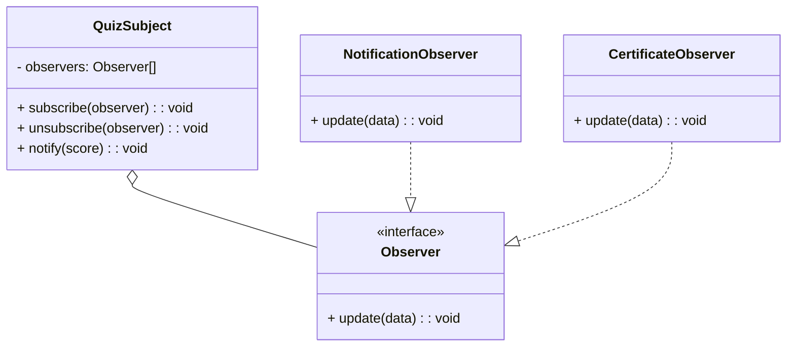
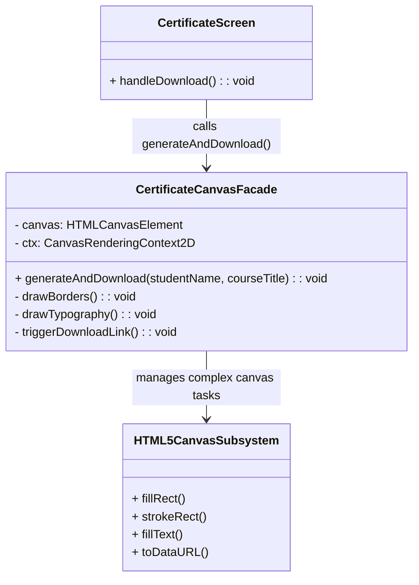

# 🎓 CAREGENICS – Smart Course Learning & Assessment Platform

CAREGENICS is an interactive, mobile-first Web Application designed for seamless course navigation, skill assessment quizzes, e-books access, and automated live certificate generation.

---

## ✨ Features

- **🎨 Mobile UI/UX Design:** Dark-themed responsive interface matching exact modern mobile wireframes.
- **🔐 User Authentication:** Interactive Sign In and Registration screens with social login support.
- **📚 Course Catalog & Filtering:** Dynamic course listing with category filters (`All`, `🔥 Running`, `🎁 Offers`, `BBA`, `CSE`, `EEE`).
- **📖 eBooks Module:** Direct visual access to programming language e-books (Python, Java, C++, JavaScript, R, Swift).
- **📝 Interactive Quiz Assessment:** MCQ assessment module complete with a progress bar, live score calculation, and result analysis.
- **📜 Live Certificate Generator:** Auto-generates downloadable PNG certificates using HTML5 Canvas with custom student names and dynamic issue dates.
- **💳 Checkout & Enrollment:** Seamless checkout flow with subscription summaries and credit card UI mockups.

---

## 🛠️ Tech Stack

- **Frontend:** React.js (Vite), Tailwind CSS, HTML5 Canvas API
- **Icons & Graphics:** Devicon Vector Logos, SVG/Unicode Icons
- **Backend (API):** Node.js / Express REST API (with MySQL / PostgreSQL database support)

---

## 📐 Design Patterns Implementation & Deliverables

This project incorporates **5 core Software Design Patterns** to ensure clean architecture, component reusability, and maintainability.

---

### 1. Singleton Pattern

#### 🔹 Name of Pattern:
**Singleton Pattern**

#### 🔹 Problem It Solves:
Creating multiple instances of API service classes leads to memory leaks, inconsistent configuration states, and redundant network connections. The Singleton pattern ensures that only **a single shared instance** of `ApiService` manages backend endpoints across the entire React application.

#### 🔹 Specific Files / Classes Involved:
- `src/services/ApiService.js` (Singleton Class)
- `src/App.jsx` (Client Component)

#### 🔹 Structure & UML Diagram:
The `ApiService` class restricts instantiation by holding a static instance reference. The static `getInstance()` method returns the existing instance or initializes it if it does not exist.



---

### 2. Factory Method Pattern

#### 🔹 Name of Pattern:
**Factory Method Pattern**

#### 🔹 Problem It Solves:
Instantiating complex UI components or output documents (like downloadable certificates or custom widgets) directly inside parent screens creates tight coupling. The Factory Method encapsulates instantiation logic, providing a uniform creation interface based on runtime parameters.

#### 🔹 Specific Files / Classes Involved:
- `src/factories/CertificateFactory.js` (Creator Factory)
- `src/components/CertificateScreen.jsx` (Concrete Product Component)

#### 🔹 Structure & UML Diagram:
`CertificateFactory` exposes a `createCertificate()` method. Depending on the requested type (`"canvas"`, `"pdf"`, or `"image"`), it instantiates the corresponding certificate class.



---

### 3. Strategy Pattern

#### 🔹 Name of Pattern:
**Strategy Pattern**

#### 🔹 Problem It Solves:
Applying conditional logic (`if-else` or `switch`) directly inside UI views to filter courses based on status or department makes code brittle and hard to maintain. The Strategy pattern encapsulates each filtering algorithm into its own strategy object, enabling seamless strategy swapping at runtime.

#### 🔹 Specific Files / Classes Involved:
- `src/strategies/FilterStrategy.js` (Strategy Interface)
- `src/strategies/RunningFilterStrategy.js` (Concrete Strategy)
- `src/strategies/OfferFilterStrategy.js` (Concrete Strategy)
- `src/App.jsx` (Context)

#### 🔹 Structure & UML Diagram:
The application context holds a reference to `FilterStrategy`. Selecting a category pill on the UI dynamically changes the active strategy execution.



---

### 4. Observer Pattern

#### 🔹 Name of Pattern:
**Observer Pattern**

#### 🔹 Problem It Solves:
When a student completes an assessment quiz, multiple independent components need to update automatically (e.g., progress ring updates, certificate eligibility unlocking, top notification bar updates). The Observer pattern establishes a one-to-many relationship, automatically notifying all subscriber components when a quiz state changes.

#### 🔹 Specific Files / Classes Involved:
- `src/observers/QuizSubject.js` (Subject/Publisher)
- `src/observers/NotificationObserver.js` (Observer Subscriber)
- `src/components/QuizScreen.jsx` (Trigger Event)

#### 🔹 Structure & UML Diagram:
`QuizSubject` maintains a list of `Observer` instances and triggers their `update()` methods upon quiz completion.



---

### 5. Facade Pattern

#### 🔹 Name of Pattern:
**Facade Pattern**

#### 🔹 Problem It Solves:
Rendering a downloadable certificate via HTML5 Canvas involves dealing with low-level, complex APIs: setting canvas dimensions, stroke colors, double borders, custom typography alignment, date formatting, and blob/data-URL conversion. The Facade pattern simplifies these multi-step subsystem operations behind a single method call: `generateAndDownload()`.

#### 🔹 Specific Files / Classes Involved:
- `src/facades/CertificateCanvasFacade.js` (Facade Class)
- `src/components/CertificateScreen.jsx` (Client Interface)

#### 🔹 Structure & UML Diagram:
`CertificateScreen` delegates drawing and download management to `CertificateCanvasFacade`, which manages the underlying HTML5 Canvas methods.



---

## 📁 Project Structure

```text
frontend/
├── src/
│   ├── components/
│   │   ├── CourseList.jsx         # Handles course cards & filtering UI
│   │   ├── QuizScreen.jsx         # Interactive assessment module
│   │   └── CertificateScreen.jsx  # Live Canvas certificate generator
│   ├── App.jsx                    # Core screen routing and mobile layout
│   ├── index.css                  # Tailwind CSS styling
│   └── main.jsx                   # Application entry point
├── package.json
└── README.md
```

---

## 🚀 Getting Started

1. **Clone the repository:**
   ```bash
  https://github.com/ayeshasiddikaa728-code/Course-Learning-Platfrom.git
   cd caregenics-learning-platform/frontend
   ```

2. **Install dependencies:**
   ```bash
   npm install
   ```

3. **Start development server:**
   ```bash
   npm run dev
   ```

4. **View in Browser:**  
   Navigate to `http://localhost:5173` in your web browser.

---

## 👤 Author

Developed for academic project submission covering Full-Stack Web Development and Software Architecture Design Patterns.
